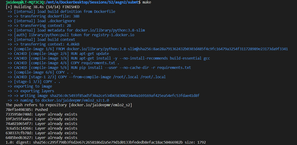
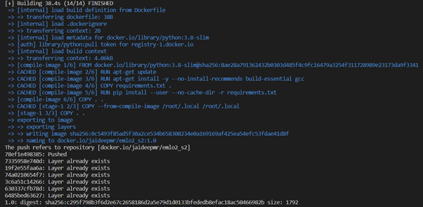
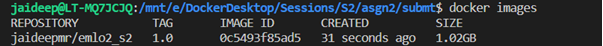
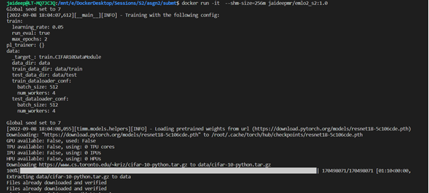
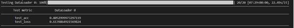
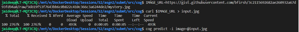
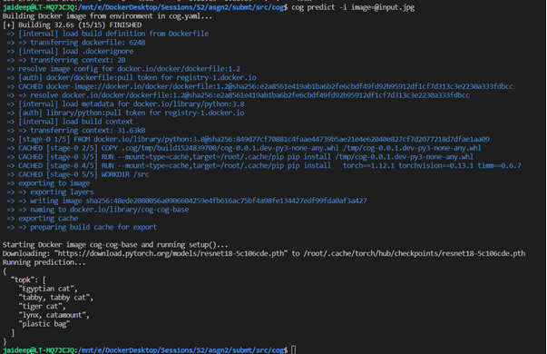

**Repository github url : https://github.com/jai-mr/Sessions/tree/main/Session02 <br/>
**Assignment Repository : https://github.com/jai-mr/Sessions/blob/main/Session02/README.md <br/>
**Submitted by : Jaideep R - No Partners<br/>
**Registered email id : jaideepmr@gmail.com<br/>

## Objective


* Use the template
	https://github.com/ashleve/lightning-hydra-template
* Add CIFAR10 datamodule (see how MNIST is integrated with the template, and similarly integrate CIFAR10)
  Refer to this - CIFAR10 training: https://colab.research.google.com/drive/1dnc5jVmCLN1UsSL_p4X9UNgE77Y6UpoD?usp=sharing
  (https://juliusruseckas.github.io/ml/lightning.html ,
  https://pytorch-lightning.readthedocs.io/en/stable/notebooks/lightning_examples/cifar10-baseline.html 
  see create_model call, and use timm pretrained model there  
* It should include a Makefile for building the docker image, i.e. doing make build on terminal should build the docker image.
* Include scripts train.py and eval.py for training and eval(metrics) for the model, 
  docker run <image>:<>tag python3 src/train.py experiment=experiment_name.yaml
* Include COG into this for inference only (image) inference , any pretrained timm model, or the model trained above on a given image.

### Make File

* [Github Link to Makefile](https://github.com/jai-mr/Sessions/blob/main/Session02/Makefile)
	
* Makefile Commands Used
	* Make
	* Make build 
	* Make push
	* Make all

* Makefile Execution
 * Image for Makefile Execution
	
	
 * Docker Image created after Makefile execution
	

### Training & Validation using the Docker Image

* Command<br/>
	`docker run -it --shm-size=256m jaideepmr/emlo2_s2:1.0`

* Output of Training using the docker image<br/>
	
	
	

### Running Inference using COG
* Commands Executed
	```
	cd src/cog
	curl $IMAGE_URL > input.jpg
	```
	`cog predict -i image=@input.jpg`

 * To run the evalution<br/>
	`docker run -it --shm-size=256m jaideepmr/emlo2_s2:1.0 python src/train.py run_eval=true`
 	
	
 * Inference Output<br/>
 		
