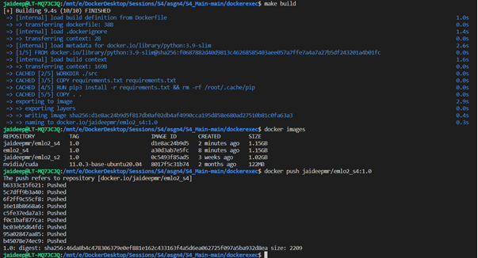
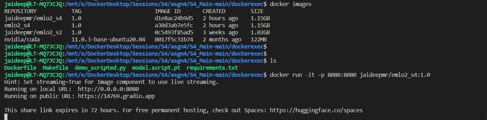
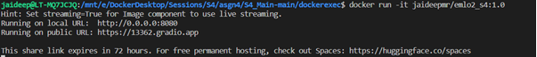
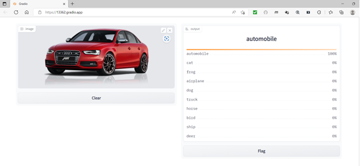
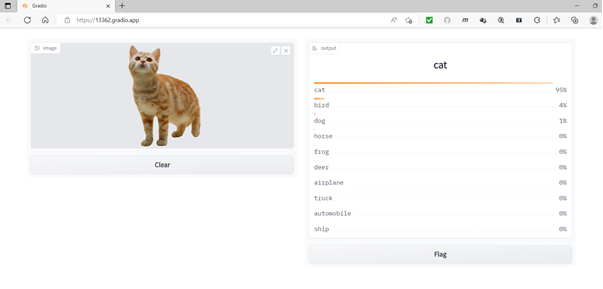

**Repository github url : https://github.com/jai-mr/Sessions/tree/main/Session04  
**Assignment Repository : https://github.com/jai-mr/Sessions/blob/main/Session04/README.md  
**Submitted by : Jaideep R - No Partners 
**Registered email id : jaideepmr@gmail.com 

## Objective

1. Add Demo Deployment for  trained model (scripted checkpoint) (CIFAR10 Model) & convert your model to TorchScript Scripted Model
2. It must accept image from user, and give the top 10 predictions
3. Streamlit has been used
4. The demo has been Dockerized
5. package the model (scripted only) inside the docker
6. docker image size limit is 1.2GB (uncompressed)
7. docker run -t -p 8080:8080 <image>:<tag> should start the webapp !
8. Add all the changes to your template repo, share link of the github repository
9. Push Image to DockerHub and submit link to it

### Make File

* [Github Link to Makefile](https://github.com/jai-mr/Sessions/blob/main/Session04/Makefile)
	
* Makefile Commands Used
	* Make build

* Output of Docker image creation and build 
	

* Output of Docker execution for gradio 
	  
	
	
  

 * Docker Image created after Makefile execution
	

### Training & Validation 
* 	[Jupyter Notebook Link](https://github.com/jai-mr/Sessions/blob/main/Session04/S4_Asgn.ipynb)
