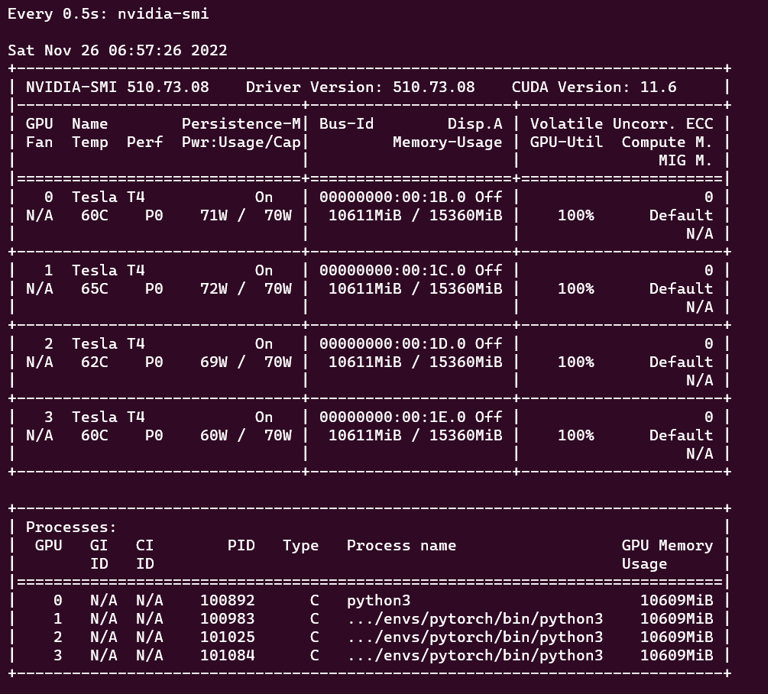
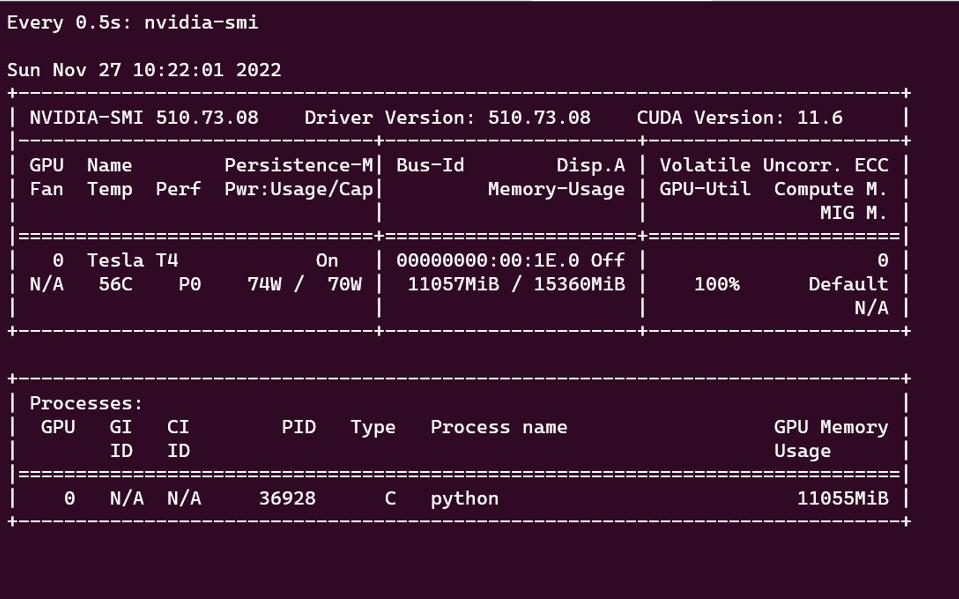
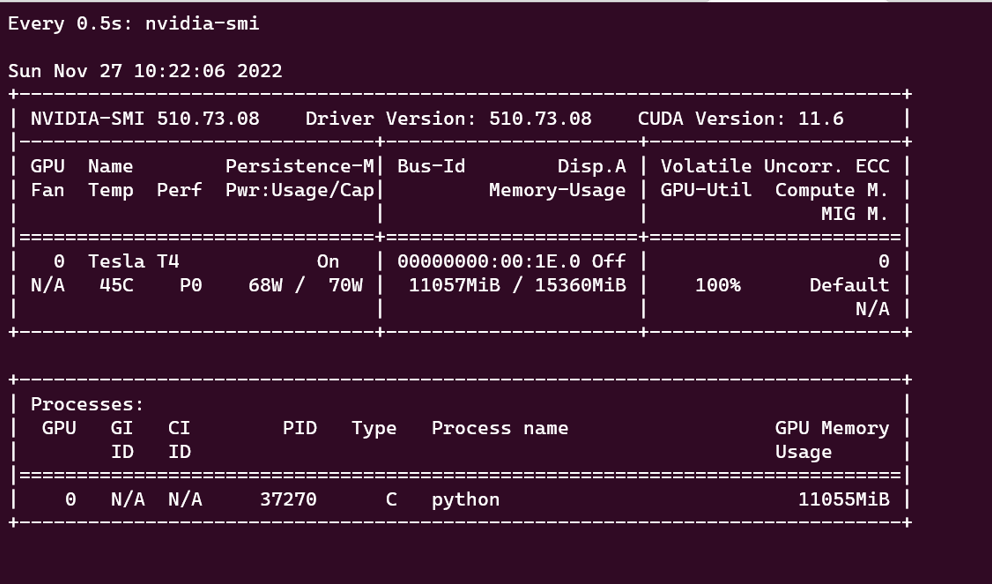
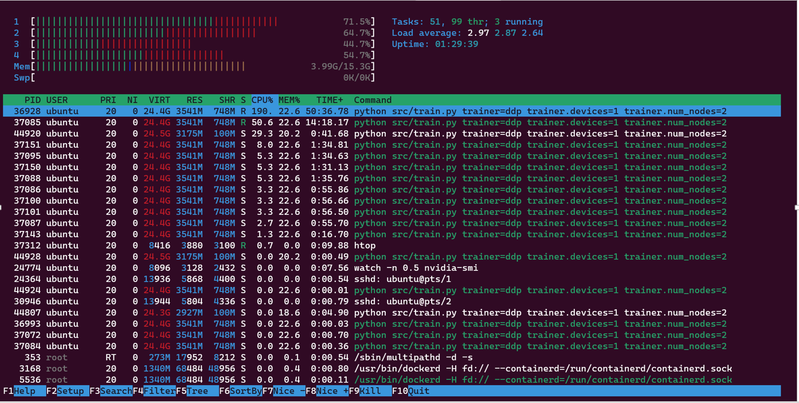
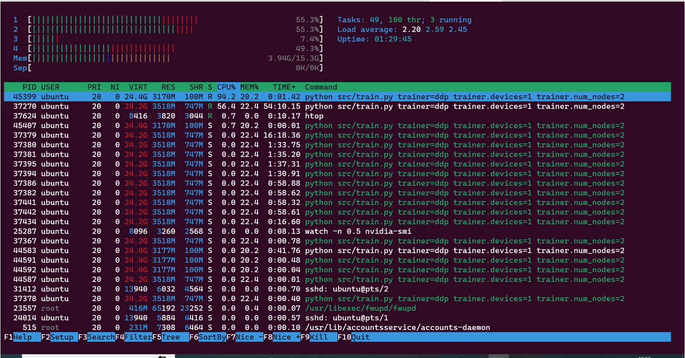

**Repository github url : https://github.com/jai-mr/Sessions/tree/main/Session06  
**Assignment Repository : https://github.com/jai-mr/Sessions/blob/main/Session06/README.md  
**Submitted by : Jaideep R - No Partners 
**Registered email id : jaideepmr@gmail.com 

### Train ViT Base using FSDP (4 GPU)
* The ViT model has been trained for 25 epochs  on a g4dn.12x large of a g4dn family 48vCPU 192Gib Memory
* The highest batch size achieved is  256 < Was failing with memory insufficient for all greater values > 
* Best checkpoint is stored into AWS S3 : https://jrl-aws-bucket.s3.ap-south-1.amazonaws.com/s6/fsdp/last.ckpt
* Link to Tensorboard logs on Tensorboard.dev : https://tensorboard.dev/experiment/4zaHVsa9T8yzrdAsbPOO1g/
* Training Time: 2685.183524131775 (s)
* NVIDIA - SMI Output 
	
* Htop Output	 
	
* Metrics 
	

### Train ViT Base using DDP (4 GPU x 2 Nodes)
* The ViT model has been trained for 25 epochs  on a g4dn.x large of a g4dn family 4vCPU 16 Gib Memory
* The highest batch size achieved is  256 < Was failing with memory insufficient for all greater values > 
* Best checkpoint of both to AWS S3 : https://jrl-aws-bucket.s3.ap-south-1.amazonaws.com/s6/ddp/last.ckpt
* Link to Tensorboard logs on Tensorboard.dev : https://tensorboard.dev/experiment/Pr499PcZRfeLmEG1vvQyUg/
* Training Time: 4742.513200998306 (s)
* NVIDIA - SMI Output - Master 
	
* NVIDIA - SMI Output - Worker Node	 
	
* Htop Output - Master 
	
* Htop Output - Worker Node 
	
* Metrics 
	

### Program to copy last checkpoint file to aws bucket
[uploadtoaws.py](https://github.com/jai-mr/Sessions/blob/main/Session06/uploadtoaws.py)

you can run the testing script after training the model to get the final model metrics

