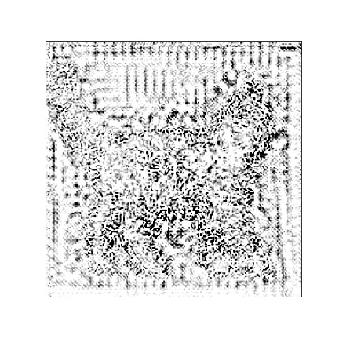
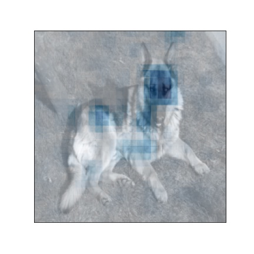
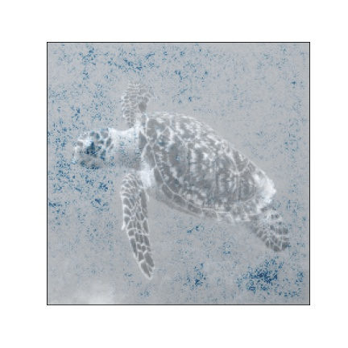
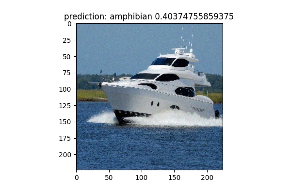
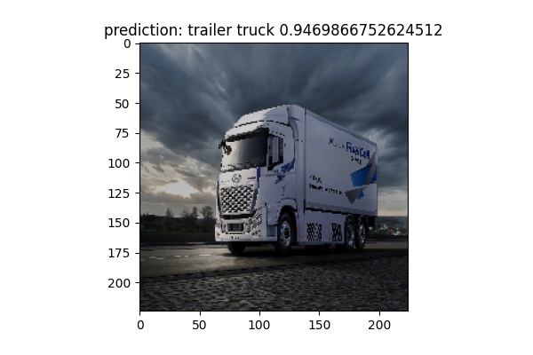

**Repository github url : https://github.com/jai-mr/Sessions/tree/main/Session07  
**Assignment Repository : https://github.com/jai-mr/Sessions/blob/main/Session07/README.md  
**Submitted by : Jaideep R - No Partners 
**Registered email id : jaideepmr@gmail.com 

### Model Explanation with
  1. IG
  2. IG w/ Noise Tunnel
  3. Saliency
  4. Occlusion
  5. SHAP
  6. GradCAM
  7. GradCAM++

< Click on Cell Image to get full view of image> 

| Original Image | IG |       Noise Tunnel | Saliency | Occlusion | SHAP | GradCAM | GradCAM++ |
:----------------------------:|:--------------------------------:|:--------------------------------:|:--------------------------------:|:--------------------------------:|:--------------------------------:|:--------------------------------:|:--------------------------------:|
|  |  |  |  |  |  | 
|  |  |  |  |  |  | 
|  |  |  |  |  |  | 
|  |  |  |  |  |  | 
|  |  |  |  |  |  | 
|  |  |  |  |  |  | 
|  |  |  |  |  |  | 
|  |  |  |  |  |  | 
|  |  |  |  |  |  | 
|  |  |  |  |  |  | 

### Adversarial Attacks to predict persian cat

* Using PGD <Projected Gradient Descent> which is an iterative version of  FGSM (Fast Gradient Sign Method)that can generate adversarial examples. 
* It takes multiple gradient steps to search for an adversarial perturbation within the desired neighbor ball around the original inputs. 
* The following images have been modified so they all predict 'Persian cat' when predicted using the pretrained resnet18 model from timm library.

 |  | 
 |  | 
 |  | 

  
### Model Robustness with

  1. Pixel Dropout
  2. FGSM
  3. Random Noise
  4. Random Brightness

  
|        fgsm                    |           Gaussian Noise        | Pixel Dropout                  |           RandomBrightnesss |
|:------------------------------:|:-------------------------------:|:------------------------------:|:------------------------------:|
|  |  |  |  |
|  |  |  |  |
|  |  |  |  |
|  |  |  |  |
|  |  |  |  |
|  |  |  |  |
|  |  |  |  |
|  |  |  |  |
|  |  |  |  |
|  |  |  |  |

# [Link to source code](https://github.com/jai-mr/Sessions/tree/main/Session07/src)
