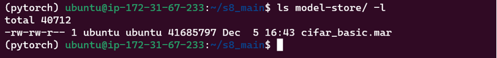
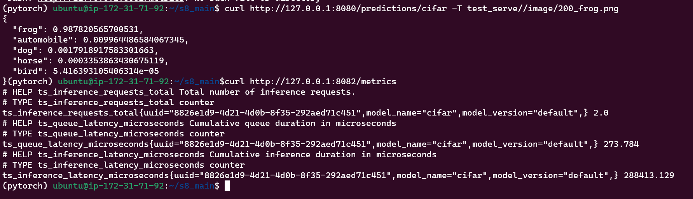
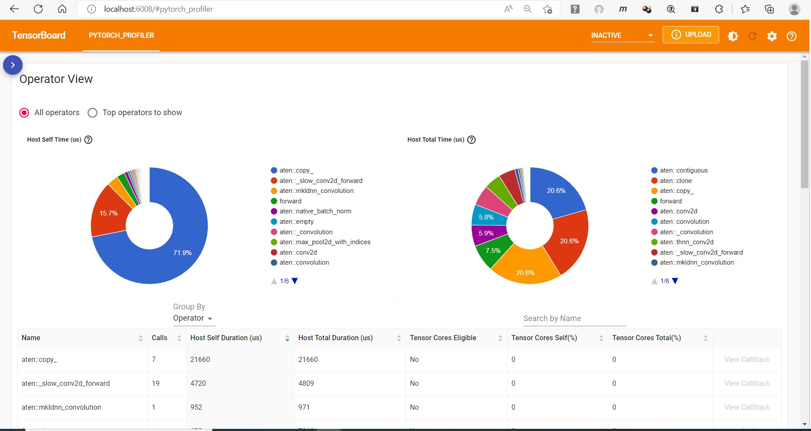
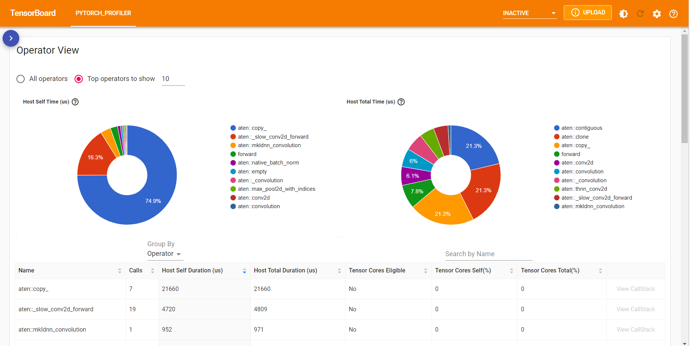
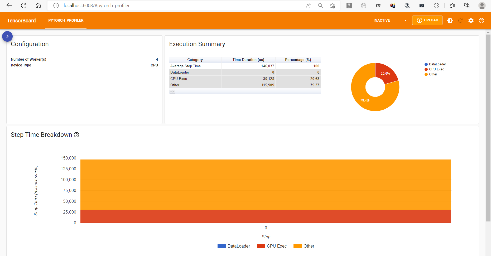

**Repository github url : https://github.com/jai-mr/Sessions/tree/main/Session08 <br/>
**Assignment Repository : https://github.com/jai-mr/Sessions/blob/main/Session08/README.md <br/>
**Submitted by : Jaideep R - No Partners<br/>
**Registered email id : jaideepmr@gmail.com<br/>

**1. Scripted CIFAR trained model**<br/>



**2. Deployed model to TorchServe in an EC2 Instance**<br/>

```
$ ubuntu@ip-172-31-67-233:~/s8_main$ curl "http://localhost:8081/models"
{
  "models": [
	{
	  "modelName": "cifar",
	  "modelUrl": "model-store/cifar_basic.mar"
	}
  ]
}
```
**3. PyTest script (test_serve_cifar.py)**<br/>

* [Input Images](https://github.com/jai-mr/Sessions/tree/main/Session08/s8_main/test_serve/image)  <br/>

* i. REST API Inference<br/>

- [Python File](https://github.com/jai-mr/Sessions/blob/main/Session08/s8_main/test_serve/test_serve_cifar.py)<br/>
- [Output of script](https://github.com/jai-mr/Sessions/blob/main/Session08/img/2.png)<br/>
- [Response](https://github.com/jai-mr/Sessions/blob/main/Session08/s8_main/output/restapi.log)<br/>

* ii. gRPC API Inference<br/>

  * [Python File](https://github.com/jai-mr/Sessions/blob/main/Session08/s8_main/test_serve/test_serve_grpc.py)<br/>
  * [Output of script](https://github.com/jai-mr/Sessions/blob/main/Session08/img/3.png)<br/>
  * [Response](https://github.com/jai-mr/Sessions/blob/main/Session08/s8_main/output/grpcapi.log)<br/>

* iii. captum model explanation<br/>

  * [Python File](https://github.com/jai-mr/Sessions/blob/main/Session08/s8_main/test_serve/test_serve_captum.py)<br/>
  * [Output of script](https://github.com/jai-mr/Sessions/blob/main/Session08/img/4.png)<br/>
  * [Model Explanation](https://github.com/jai-mr/Sessions/blob/main/Session08/s8_main/test_serve/10_deer_ig.png)<br/>


**4. Inference Metrics**<br/>

<br/>

**5. TensorBoard Profiler**<br/>

<br/>
<br/>
<br/>


