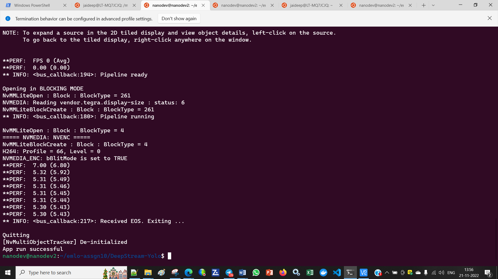

**Repository github url : https://github.com/jai-mr/Sessions/tree/main/Session10  
**Assignment Repository : https://github.com/jai-mr/Sessions/blob/main/Session10/README.md  
**Submitted by : Jaideep R - No Partners 
**Registered email id : jaideepmr@gmail.com 

### 1. yolov7-tiny
* Youtube Link : https://youtu.be/h4gDqTMkaQU
* FPS: 5.6
* Output for YoloV7 object detection stats 
	
  
### 2. yolov7
Youtube Link : https://youtu.be/DYgMGh70pxc
FPS: 5.68
* Output for YoloV7=tiny object detection stats
	

### JTop Stats for Jent Nano Device

